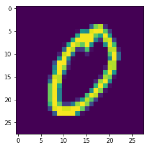
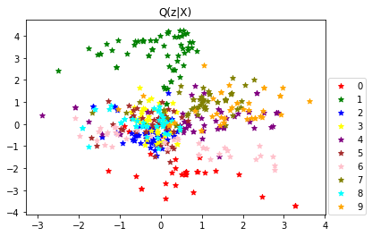
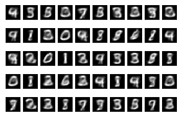

```python
from tensorflow.examples.tutorials.mnist import input_data
from keras.layers import Input, Dense, Lambda, Dropout
from keras.models import Model
from keras.objectives import binary_crossentropy
from keras.callbacks import LearningRateScheduler

import numpy as np
import matplotlib.pyplot as plt
import keras.backend as K
import tensorflow as tf

```

    Using TensorFlow backend.
    

## Loading and Preprocessing MNIST Dataset

#### Load the MNIST dataset


```python
from keras.datasets import mnist

(x_train, y_train), (x_test, y_test) = mnist.load_data()

```


```python
print(x_train.shape)
input_num, input_rows, input_cols = x_train.shape   # get the width, height and the number of sample images
print("Rows = ", input_rows, "      Columns = ", input_cols, "     Number of Examples = ", input_num)

# Number of features (28*28 image is 784 features) or size of input vector
n_features = input_rows * input_cols

```

    (60000, 28, 28)
    Rows =  28       Columns =  28      Number of Examples =  60000
    


```python
import collections as cl

# Let's check the number of examples of each class (i.e., digit)
example_cnt = cl.Counter(y_train)
print(dict(example_cnt))

n_classes = len(list(example_cnt))
print("number of classes: ", n_classes)
```

    {0: 5923, 1: 6742, 2: 5958, 3: 6131, 4: 5842, 5: 5421, 6: 5918, 7: 6265, 8: 5851, 9: 5949}
    number of classes:  10
    


```python
# In order to run faster, we're only looking at m=1000 sample images that are picked up randomly from MNIST dataset

m = 1000    # number of examples for the training dataset

indices = np.random.randint(input_num, size=m)

mnist_features= x_train[indices]
mnist_labels  = y_train[indices]

# dataset for validation
n = 200     # number of examples for validation 
indices_val = np.random.randint(x_test.shape[0], size=n)

X_val = x_train[indices_val]
y_val = y_train[indices_val]

```


```python
# check again the number of examples in each class - expect to see roughly the same number
random_example_cnt = cl.Counter(mnist_labels)
print(dict(random_example_cnt))
```

    {0: 86, 1: 116, 2: 101, 3: 111, 4: 102, 5: 85, 6: 98, 7: 106, 8: 98, 9: 97}
    


```python
import random

one_random_example = random.randint(0, m)
print(one_random_example)

plt.imshow(mnist_features[one_random_example])
plt.show()

print(mnist_labels[one_random_example])
```

    988
    





    0
    

The MNIST images only have a depth of 1, but usually we must explicitly declare that.
In CNN, we want to transform our dataset from having shape (n, width, height) to (n, depth, width, height).
However in VAE, the input dimension has been defined as (n, 784), so we just need to reshape the MNIST dataset to this shape.


```python
# X_train = mnist_features.reshape(m, 1, input_rows, input_cols)
X_train = mnist_features.reshape(m, n_features)

X_val = X_val.reshape(n, n_features)
```

The final preprocessing step for the input data is to convert our data type to float32 and normalize our data values to the range [0, 1].


```python
X_train = X_train.astype('float32')
X_train /= 255

X_val = X_val.astype('float32')
X_val /= 255
```

## Constructing Necessary Layers and Functions for VAE

We are going to build the VAE model which consists of two parts with one latent variable z in between: Encoder <-> z <-> Decoder

                    inputs (28x28 images flattened to 784x1 vectors)
                          |
                     h_q (1st FC hidden layer of encoder, 512 units)
                        |          |
                       mu       log_sigma   (FC output layer of encoder, 2 units for both)
                        \          /
                         \        /
                          z = sample_z([mu, log_sigma])      Note: loss function only looks at mu and log_sigma, thus is continuous
                          |
                         h_p  (1st FC hidden layer of decoder, 512 units)
                          |
                        outputs (FC, 784 units)
Then
     
     VAE = Model(inputs, outputs)    
     encoder = Model(inputs, mu)
     decoder = Model(z, outputs)
 
Note: mu and log_sigma are 2-dimensional, i.e., n_z = 2, this is simply because we want to present the mapping from X to z space visually.
      In practical use of VEA, n_z should be much larger in order for X of different classes to be apart from each other in z space.

Let's first construct the input vector of decoder, i.e., the latent variable z.

As the re-parameterization trick, we first sample epsilon from N(0,I) as input to decoder, and convert epsilon to z ∼ N(μ,Σ) in the decoder network by:

z =μ+power(Σ, 0.5)* epsilon

This conversion allows the network to be "continuous and derivatible" (while sampling is not) so that backprop SGD can run through it.

For arithmetic purpose in case Σ is very small, we use logarithm of Σ denoted by log_sigma=log(Σ) instead of Σ.


```python
def sample_z(args):
    """ args: expected to be [mu, log_simga] in which mu and log_sigma are multi-dimensional vectors."""
    mu, log_sigma = args
    epsilon = K.random_normal(shape=(1, n_z), mean=0., stddev=1., dtype=tf.float32)    # n_z = 2 dimensions.
    
    # note that mu and log_sigma below refer to h_q which then refers up to inputs.  
    return mu + K.exp(log_sigma / 2) * epsilon
```

Now we need to define loss function of VAE.
As we are not using an existing loss function, we pass a TensorFlow/Theano symbolic function that returns a scalar **for each data-point** and takes the following two arguments:

y_true: True labels. TensorFlow/Theano tensor.

y_pred: Predictions. TensorFlow/Theano tensor of the same shape as y_true.

The actual optimized objective is **the mean of the output array across all datapoints**.


```python
def vae_loss(y_true, y_pred):
    """ Calculate loss = reconstruction loss + KL loss for each data in minibatch """
    
    # E[log P(X|z)]
    recon = K.sum(K.binary_crossentropy(y_pred, y_true), axis=1)
    
    # D_KL(Q(z|X) || P(z|X)); calculate in closed form as both dist. are Gaussian
    kl = 0.5 * K.sum(K.exp(log_sigma) + K.square(mu) - 1. - log_sigma, axis=1)

    return recon + kl
```

### We are ready for defining all the layers of VAE.


```python
from keras.layers import Activation, Flatten, Conv2D, MaxPooling2D
from keras.optimizers import SGD
import keras.utils

n_z = 2               # dimensions of latent varaible z, i.e., 2D Normal distribution
dropout_rate = 0.5    # hyper-parameter: Dropout Keep-Rate

# Q(z|X) -- build the encoder model

inputs = Input(shape=(n_features,))
h_q = Dense(512, activation='relu')(inputs)        # 1st hidden FC layer 784 inputs -> 512 ReLU outputs
#h_d = Dropout(dropout_rate)(h_q)                   # dropout layer
mu = Dense(n_z, activation='linear')(h_q)          # output layer -> mu vector of size n_z
log_sigma = Dense(n_z, activation='linear')(h_q)   # output layer -> log_sigma vector of size n_z

```


```python
# Sample z~ Q(z|X), and z will be the input of Decoder (down to outputs of the whole VAE model)
z = Lambda(sample_z)([mu, log_sigma])   # Lambda wraps sample_z as a layer object so that SGD can run through it as well
```

Now we create the decoder net P(X|z)


```python
# P(X|z) -- decoder
decoder_hidden = Dense(512, activation='relu')          # hidden FC layer of decoder
decoder_out = Dense(n_features, activation='sigmoid')   # the final layer should output the vectors similar to X

h_p = decoder_hidden(z)       # z as input to decoder
outputs = decoder_out(h_p)    # output layer
```

### Constructing the Models

Lastly, with the definition of layers above, we can build a complete VAE model that reconstructs the inputs, or build a model that encodes inputs into latent variables so that we can visualize the distribution of X in z space, or build a model that generates data from latent variable. So, we have three Keras models:

#### 1. VAE Model


```python
# the 1st model: Overall VAE model, for training and input reconstruction (X_train as input AND output)

VAE = Model(inputs, outputs)
```


```python
# And train the model:
n_epoch = 50              # hyper-parameters
batch_size = 128

VAE.compile(optimizer='adam', loss=vae_loss)
VAE.fit(X_train, X_train, shuffle=True, batch_size=batch_size, epochs=n_epoch, validation_data=(X_val, X_val))
```

#### 2. Encoder


```python
# the 2nd model: encoder model, to encode input into latent variable
# We use the mean as the output as it is the center point, the representative of the Gaussian
encoder = Model(inputs, mu)

```

Take 500 examples of test dataset and present them in z-space, i.e., Q(z|X) that represents X -> mu distribution in z-space.


```python
#np.random.seed(seed=7)
num_examples = 500
random_examples_idx = np.random.randint(m, size=num_examples)  # get randomly 500 examples of which every digit should be included

random_examples_x = x_test[random_examples_idx]
random_examples_y = y_test[random_examples_idx]

colors = ['red', 'green', 'blue', 'yellow', 'purple', 'brown', 'pink', 'olive', 'cyan', 'orange']
```


```python
# check how many examples out of 500 each digit has
example_y_cnt = cl.Counter(random_examples_y)
print(example_y_cnt)
print(dict(example_y_cnt))   
```

    Counter({2: 65, 1: 63, 7: 59, 4: 56, 3: 49, 5: 46, 8: 45, 6: 43, 9: 42, 0: 32})
    {0: 32, 1: 63, 2: 65, 3: 49, 4: 56, 5: 46, 6: 43, 7: 59, 8: 45, 9: 42}
    


```python
# we can get multiple outputs, say 500, from encoder all at once, by putting all the examples in one batch
input_examples = random_examples_x.reshape(num_examples, n_features)    # reshape the inputs to the same shape as defined for input
input_examples = input_examples.astype('float32')
input_examples /= 255   # normalization

# run the encoder
example_mu = encoder.predict(input_examples, batch_size=num_examples)
```


```python
# categorize and put in different bins the points (mu) according to their labels
classified_output = {'0':[], '1':[], '2':[], '3':[], '4':[], '5':[], '6':[], '7':[], '8':[], '9':[]}

zipped_data = zip(example_mu, random_examples_y)    # binding (mu, label)

for predict_mu, label in list(zipped_data):
    classified_output[str(label)].append(predict_mu)  # add each output to its own bin
```


```python
# to plot the classified points, we need to get x and y respectively from classified_output which has the shape of (num, 2).
# each point has two columns, so x = 1st column, y = 2nd column
for i in range(n_classes):
    stacked_output = np.vstack((classified_output[str(i)]))   # stack all the points vertically
    x = stacked_output[:, 0]     # 1st column
    y = stacked_output[:, 1]     # 2nd column
    plt.scatter(x, y, color=colors[i], marker='*', label=str(i))

# add a title
plt.title("Q(z|X)")

# create a legend 
plt.legend(loc=(1.01, 0), scatterpoints=1)   # left-bottom of figure is (0, 0) for location of legend

plt.show()
```





#### 3. Decoder/Generator


```python
np.random.seed(7)
```


```python
# the 3rd model: decoder/generator model, generates new data (e.g., images similar to training dataset) given latent variable z
# Let's try to generate multiple images all at once

d_in = Input(shape=(n_z,))     # decoder input layer, returns a tensor
d_h = decoder_hidden(d_in)     # decoder hidden layer that has been trained above
d_out = decoder_out(d_h)       # decoder output layer that has been trained above
decoder = Model(d_in, d_out)

output_num = 50                # the number of new images to be generated
z = np.random.randn(output_num, n_z)       # generate output_num of 2D random variables from standard normal distribution

output_image_list = decoder.predict(z, batch_size=output_num)   # run decoder and get outputs of new images in 1D vector form
```


```python
def plot_image_list(image_list, nrows, ncols, img_size, control=None):
    """ Plot in nrows-by-ncols grid a list of images that have 1D form, so need to reshape them to 2D before ploting."""
    
    num_images = len(image_list)
    assert (num_images == nrows*ncols), "Number of images does not match rows and columns"
    
    i=0          # used as index both to image_list and to each subplot (starting from 1)
    for row in range(nrows):
        for col in range(ncols):
            image = image_list[i].reshape(input_rows, input_cols)    # reshape the output from 1D to 2D in order to plot it
           
            plt.subplot(nrows, ncols, i+1)   # i+1 is the index number of the image in the nrows*ncols grid
            plt.imshow(image,cmap=control)
            
            # Axes are no longer useful, so it's better to hide them
            cur_axes = plt.gca()    # get current axes (gca)
            cur_axes.axes.get_xaxis().set_visible(False)   # hide x axis
            cur_axes.axes.get_yaxis().set_visible(False)   # hide y axis
            
            i = i+1
    
    plt.show()

```


```python
plot_image_list(output_image_list, 5, 10, 8, control='gray')
```




